# Container Starter Kit 開発編
本ハンズオンでは、OpenShift上で動かすコンテナアプリを実装するために必要となる作業を体験して頂くことで、コンテナアプリ作成に必要な知識を学習し、理解を深めることを目的とします。

- [Container Starter Kit 開発編](#container-starter-kit-開発編)
  - [1. コンテナアプリ必要機能の実装](#1-コンテナアプリ必要機能の実装)
    - [1.1 CPU/Memoryリソース設定](#11-cpumemoryリソース設定)
    - [1.2 ログ出力](#12-ログ出力)
    - [1.3 外部ストレージとの連携](#13-外部ストレージとの連携)
    - [1.4 コンテナライフサイクル管理](#14-コンテナライフサイクル管理)
    - [1.5 Metrics監視](#15-metrics監視)
      - [1.5.1 NGINX Prometheus Exporterの設定](#151-nginx-prometheus-exporterの設定)
      - [1.5.2 Prometheus設定](#152-prometheus設定)
      - [1.5.3 動作確認](#153-動作確認)
  - [2. OpenShift上でのコンテナイメージビルド方法](#2-openshift上でのコンテナイメージビルド方法)
    - [2.1 Binaryソースを使用したS2Iビルド](#21-binaryソースを使用したs2iビルド)
    - [2.2 Binaryソースを使用したDockerビルド](#22-binaryソースを使用したdockerビルド)
  - [3. マイクロサービス簡易体験](#3-マイクロサービス簡易体験)
    - [3.1 モノリスアプリのデプロイ](#31-モノリスアプリのデプロイ)
    - [3.2 モノリスアプリの分割](#32-モノリスアプリの分割)
      - [3.2.1 Node.js Podのデプロイ](#321-nodejs-podのデプロイ)
      - [3.2.2 Node.js Podとモノリスアプリ公開APIの連携設定](#322-nodejs-podとモノリスアプリ公開apiの連携設定)
    - [3.3 マイクロサービスのスケーラビリティ体験](#33-マイクロサービスのスケーラビリティ体験)
    - [[任意演習] 3.4 Service Meshによるマイクロサービス間での通信エラー対応](#任意演習-34-service-meshによるマイクロサービス間での通信エラー対応)
      - [3.4.1 通信エラー時の挙動確認](#341-通信エラー時の挙動確認)
      - [3.4.2 Service Meshによるタイムアウト設定](#342-service-meshによるタイムアウト設定)
        - [3.4.2.1 RouterとNode.js podの経路設定](#3421-routerとnodejs-podの経路設定)
        - [3.4.2.2 Node.js podからJava Webアプリ通信時のtimeout設定](#3422-nodejs-podからjava-webアプリ通信時のtimeout設定)
        - [3.4.2.3 Envoy Proxy(=Sidecar)挿入設定](#3423-envoy-proxysidecar挿入設定)
      - [3.4.3 動作確認](#343-動作確認)

## 1. コンテナアプリ必要機能の実装

本章は、Nginxを使用して、コンテナアプリに必要となる機能の実装体験することを目的とします。

最初に、Nginxを起動します。具体的には、本ドキュメント格納Gitリポジトリの`resources/nginx`配下に格納されているhtml等のソースコードとOpenShift提供のNginxベースイメージを使用して、新たにコンテナイメージを作成し、そのコンテナイメージをPodとして起動します。

最初に、Web Terminalを起動します。ブラウザよりOpenShift Web Consoleにアクセスし、ログイン後、画面右上の>_アイコンをクリックし、Web Terminalを起動します。

初回起動時は、以下のWeb Terminal設定情報を保存するプロジェクト作成画面となる場合もありますので、その場合は、プロジェクト名に`dev-<あなたのユーザー名>`(例: dev-user1)を入力し、開始ボタンを押して下さい。

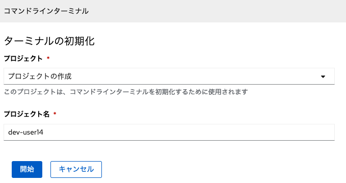  

> 補足: 初回起動時は、少々時間がかかりますので、お待ち下さい。

  


次に、Web Terminal上から、OpenShift上にプロジェクト(名前: nginx-<ユーザー名>)を使用し(=講師により作成済みです)、Nginx起動のために必要な操作を行います。

```
oc project nginx-$(oc whoami)
oc new-build --name=nginx-sample nginx:latest~"https://gitlab.com/openshift-starter-kit/msa-practice.git" --context-dir=resources/nginx -n nginx-$(oc whoami)
```

Build Podが起動するので、`oc logs -f <Pod名>`コマンドにより、`Push successful`メッセージが出力されるのを確認します。

次に、以下コマンドにより、Nginx Podを起動、及び、Routeを作成します。

```
oc new-app nginx-sample -n nginx-$(oc whoami)
oc expose svc nginx-sample -n nginx-$(oc whoami)
```

以下、上記コマンドの説明です。
- oc new-build
  - BuildConfigの作成用コマンド
  - `nginx:latest`
    - OpenShiftで提供するNginxベースイメージをポイントするImageStreamとそのタグ(=latest)
  - `https://gitlab.com/openshift-starter-kit/msa-practice.git`
    - ソースコード格納リポジトリ
  - `--context-dir`
    - ソースコード格納リポジトリ内にて、イメージ作成に使用するディレクトリ指定
- oc new-app
  - ImageStreamを指定して、Deployment/Service/Podを作成し、Pod起動するコマンド  

Nginxが起動したことを確認後、以下コマンドによりNginxにアクセスし、入力ソースコードとして指定したhtmlファイルの内容が取得出来ることを確認します。

```
oc exec $(oc get pod -l deployment=nginx-sample -o NAME -n nginx-$(oc whoami))  -n nginx-$(oc whoami) -- curl http://localhost:8080
```

以下、上記コマンドの説明です。
- oc exec
  - 指定するPod内部にて、`--`以降に指定するコマンドを実行するためのコマンド

出力例
```
<html>
<head>
        <title>Test NGINX passed</title>
</head>
<body>
<h1>NGINX is working</h1>
</body>
</html>
```

### 1.1 CPU/Memoryリソース設定

本節では、コンテナに対するCPU/Memoryリソース設定方法を体験する目的で、Nginxで使用するメモリ量を敢えて少ない値(=1MB)に設定し、どのような結果になるか確認します。

最初に、以下コマンドにより、NginxのDeployment(=nginx-sample)に対して、メモリlimitを設定します。

```
oc set resources deployment nginx-sample --limits=cpu=1,memory=1Mi -n nginx-$(oc whoami)
```

出力例
```
deployment.apps/nginx-sample resource requirements updated
```

`oc get pod -n nginx-$(oc whoami)`を実行し、PodのStatusが、`ContainerCreating`になっていることを確認します。

出力例
```
bash-3.2$ oc get pod -n nginx-$(oc whoami)
NAME                            READY   STATUS              RESTARTS   AGE
nginx-sample-1-build            0/1     Completed           0          46m
nginx-sample-666c5f7c59-qpsqb   0/1     ContainerCreating   0          2m48s
nginx-sample-85987c9959-kp52g   1/1     Running             0          45m
```

`ContainerCreating`になっているPodに対して、以下の用な`oc describe`を実行し、最下部にある`Events`の内容を確認します。
> 指定するPod名は、ご自身の使用環境に応じて、適宜変更して下さい。

```
oc describe pod nginx-sample-666c5f7c59-qpsqb  -n nginx-$(oc whoami)
```

出力例
```
Events:
  Type     Reason                  Age                   From               Message
  ----     ------                  ----                  ----               -------
  Normal   Scheduled               12m                   default-scheduler  Successfully assigned nginx-user1/nginx-sample-666c5f7c59-qpsqb to ip-10-0-189-243.ap-southeast-1.compute.internal
  Warning  FailedCreatePodSandBox  2m51s (x48 over 12m)  kubelet            Failed to create pod sandbox: rpc error: code = Unknown desc = pod set memory limit 1048576 too low; should be at least 12582912
 ```

上記Eventsの出力である`pod set memory limit 1048576 too low`より、割り当てメモリ量が少ないため、Nginx起動が出来ないことが分かります。この問題を解消するために、以下コマンドにより、Nginxで使用するメモリ量を32MBに指定します。

```
oc set resources deployment nginx-sample --limits=cpu=1,memory=32Mi -n nginx-$(oc whoami)
```

`oc get pod -n nginx-$(oc whoami)`を実行し、PodのStatusが、`Running`になることを確認します。

出力例
```
NAME                            READY   STATUS      RESTARTS   AGE
nginx-sample-1-build            0/1     Completed   0          61m
nginx-sample-56c7576cbb-g7jdb   1/1     Running     0          35s
```

以上で、本章は終了となります。

### 1.2 ログ出力
本章では、Pod内で標準出力に書き出したログが、oc logsやopenshift-loggingに連携されることを体験する目的で、Nginx Pod内部のShellより、任意のログメッセージを標準出力に書き込み、そのログメッセージが、oc logsや、openshift-loggingで取得出来ることを確認します。

最初に、`oc rsh`コマンドにより、指定したPod名(以下例: nginx-sample-56c7576cbb-g7jdb)に対してRemote Shell接続します。

コマンド例(Pod名は、適宜変更して下さい)
```
oc rsh -n nginx-$(oc whoami) nginx-sample-56c7576cbb-g7jdb
```

次に、以下コマンドにより、標準出力に任意のログメッセージ(以下例: Hello World)を書き込みます。

```
echo Hello World >> /proc/1/fd/1
```

次に、Remote Shell上で`exit`コマンドを実行しにより、Remote Shellからログアウトした後、`oc logs`コマンドにより、ログメッセージが取得出来ることを確認します。

```
oc logs <Nginx Pod名>
```

出力例
```
10.128.2.6 - - [13/Sep/2022:03:22:00 +0000] "GET / HTTP/1.1" 200 105 "-" "curl/7.61.1"
10.128.2.6 - - [13/Sep/2022:04:14:03 +0000] "GET / HTTP/1.1" 200 105 "-" "curl/7.79.1"
10.128.2.6 - - [13/Sep/2022:04:15:50 +0000] "GET / HTTP/1.1" 200 105 "-" "curl/7.79.1"
2022/09/13 04:26:25 [error] 19#0: *4 open() "/opt/app-root/src/hoge" failed (2: No such file or directory), client: 10.129.2.4, server: _, request: "GET /hoge HTTP/1.1", host: "nginx-sample-nginx-user1.apps.cluster-b68h9.b68h9.sandbox331.opentlc.com"
2022/09/13 04:26:25 [error] 19#0: *4 open() "/opt/app-root/src/404.html" failed (2: No such file or directory), client: 10.129.2.4, server: _, request: "GET /hoge HTTP/1.1", host: "nginx-sample-nginx-user1.apps.cluster-b68h9.b68h9.sandbox331.opentlc.com"
10.129.2.4 - - [13/Sep/2022:04:26:25 +0000] "GET /hoge HTTP/1.1" 404 153 "-" "curl/7.79.1"
hello
Hello World
```

> 以下演習は、openshift-loggingを使用し、マシンリソースの消費が大きくなりますので、演習環境によっては、実施不可能の場合がありますので、ご留意下さい。

次に、openshift-loggingで提供される[Kibana](https://docs.openshift.com/container-platform/4.10/logging/cluster-logging-visualizer.html)にアクセスし、ログメッセージを確認します。

OpenShift Web Consoleより、画面右上の格子状アイコン -> Loggingをクリックします。

  

Kibanaログイン画面にてOpenShiftログインに使用するユーザー名とパスワードを使用してログインし、`Authorize Access`画面にて、`Allow selected permissions`ボタンを押します。

> 次に、もし、Index Patternの入力画面になる場合は、Step1のIndex Patternとして、`app*`を入力し、また、Step2のTime Filter filed nameとして、`@timestamp`を選択して下さい。

その後、Kibana画面の左メニューの`Discover`をクリックし、画面上部に表示される検索バーに、`kubernetes.namespace_name: nginx-<自分のユーザー名>`と入力します。これにより、Nginx Podが存在するプロジェクトに関するログ情報を取得します。

  


`Available fields`より、`message`を`add`ボタンにより追加します。これにより、ログメッセージが、表示されるようになります。

  

標準出力に書き込みしたログメッセージが、出力されることを確認します。
> 出力されない場合は、画面右上のRefreshボタンや、Refreshボタンの上にあるTime Rangeを変更してみて下さい。

  

以上で、本章は終了です。

### 1.3 外部ストレージとの連携
本章では、外部ストレージとの連携体験を目的として、Nginx PodにPersistent Volumeをマウントし、そのPersistent Volumeにhtmlファイルを保存し、Router経由でアクセス出来ることを確認します。

最初に、以下コマンドにより、Nginx PodにPersistentVolumeをマウントします。
```
oc set volume deploy/nginx-sample --claim-size=4Mi --add --name=html-volume-1 --mount-path=/opt/app-root/src/pv -n nginx-$(oc whoami)
```

以下、上記コマンドの説明です。
- oc set volume
  - PersistentVolumeをDeploymentに対して設定するコマンド
  - `--claim-size`
    - 使用したいPersistetVolumeのサイズ
  - `--add`
    - PersistentVolume追加操作
  - `--name`
    - Deploymentで使用する任意のVolume名
  - `--mount-path`
    - PersistentVolumeのコンテナ内マウントパス

次に、以下コマンドにより、テスト用htmlファイルを作成します。

```
cat <<EOF > $HOME/pv.html
<html>
<head>
  <title>PV Test</title>
</head>
<body>
  <h1>Hello World from PV</h1>
</body>
</html>
EOF
```

次に、以下コマンドのPod名を変更した上で、Nginx PodでマウントしたPersistentVolume配下へコピーします。

```
oc cp $HOME/pv.html <Pod名>:/opt/app-root/src/pv -n nginx-$(oc whoami)
```

以下コマンドにより、PersistentVolumeにコピーしたhtmlファイルにRouter経由でアクセスし、コピーしたhtmlファイル内容が取得されることを確認します。

```
curl $(oc get route nginx-sample -o jsonpath='{.spec.host}' -n nginx-$(oc whoami))/pv/pv.html
```

出力例
```
bash-4.4 ~ $ curl $(oc get route nginx-sample -o jsonpath='{.spec.host}' -n nginx-$(oc whoami))/pv/pv.html
<html>
<head>
  <title>PV Test</title>
</head>
<body>
  <h1>Hello World from PV</h1>
</body>
</html>
```

以上で、本章は終了です。

### 1.4 コンテナライフサイクル管理

本章では、コンテナライフサイクル管理の体験を目的として、PreStop Hookの設定にて、Graceful Shutdownを想定したSleep処理を挿入し、その動作確認を行います。

最初に、以下コマンドにより、Nginx用のDeploymentリソースを編集モードで開きます。

```
oc edit deploy nginx-sample -n nginx-$(oc whoami)
```

次に、`spec.template.spec.containers`配下のNginxコンテナ定義箇所に以下内容を追記します。

> 注意: 手動編集ですので、空白行のズレ等にご注意下さい。

```
        lifecycle:
          preStop:
            exec:
              command:
              - /bin/sh
              - -c
              - echo "let's sleep at $(date)!!" >> /opt/app-root/src/pv/sleep.log; sleep 5
```              

編集結果例(一部抜粋)
```
      - image: image-registry.openshift-image-registry.svc:5000/nginx-user1/nginx-sample@sha256:47942734057f45a49d5b072a76edc10e882570f0765f5dc5b5a7be4ee9838e11
        imagePullPolicy: IfNotPresent
        lifecycle:
          preStop:
            exec:
              command:
              - /bin/sh
              - -c
              - echo "let's sleep at $(date)!!" >> /opt/app-root/src/pv/sleep.log;
                sleep 5
        name: nginx-sample
        ports:
        - containerPort: 8443
          protocol: TCP
        - containerPort: 8080
          protocol: TCP
```          

Deployment編集後、Nginxが自動的に再起動されます。再起動された後、Nginx Podを以下コマンドにより削除します。

```
oc delete pod <Nginx Pod名> -n nginx-$(oc whoami)
```

再度、Nginx Podが起動するので、oc execコマンドにより、PreStopで定義したメッセージが、sleep.logに出力されていることを確認します。

```
oc exec <Pod名> -n nginx-$(oc whoami) -- cat /opt/app-root/src/pv/sleep.log
```

出力例
```
let's sleep at Tue Sep 13 10:32:59 UTC 2022!!
```

以上で、本章は終了です。
次の演習のために、マウントしたPersistentVolumeを以下コマンドでアンマウントして下さい。
```
oc set volume deploy/nginx-sample --name=html-volume-1 --remove -n nginx-$(oc whoami)
```

### 1.5 Metrics監視
> 本章は、OpenShift初学者にとっては、難易度が少々高いので、時間に余裕のある方向けの内容となっております。

本章では、Metrics監視設定方法を体験する目的で、Nginx Podに[NGINX Prometheus Exporter](https://github.com/nginxinc/nginx-prometheus-exporter)をコンテナとして組み込むことでMetrics公開を行い、openshift-monitoringからMetrics表示確認を行います。

#### 1.5.1 NGINX Prometheus Exporterの設定

最初に、Nginx Deploymentに、NGINX Prometheus Exporterをコンテナとして起動する設定を行います。

最初に、以下コマンドにより、Nginx用Deploymentを編集モードで開きます。

```
oc edit deploy nginx-sample -n nginx-$(oc whoami)
```

次に、`spec.template.spec.containers`配下に以下内容を追記します。

> 注意: 手動編集ですので、空白行のズレ等にご注意下さい。

```yaml
      - name: nginx-exporter
        image: 'nginx/nginx-prometheus-exporter:0.10.0'
        args:
          - '-nginx.scrape-uri=http://localhost:8080/stub_status'
        resources:
          limits:
            memory: 128Mi
            cpu: 500m
        ports:
          - containerPort: 9113
```

編集結果例(一部抜粋)
```
  template:
    metadata:
      annotations:
        openshift.io/generated-by: OpenShiftNewApp
      creationTimestamp: null
      labels:
        deployment: nginx-sample
    spec:
      containers:
      - name: nginx-exporter
        image: 'nginx/nginx-prometheus-exporter:0.10.0'
        args:
          - '-nginx.scrape-uri=http://localhost:8080/stub_status'
        resources:
          limits:
            memory: 128Mi
            cpu: 500m
        ports:
          - containerPort: 9113      
      - image: image-registry.openshift-image-registry.svc:5000/nginx-user1/nginx-sample@sha256:47942734057f45a49d5b072a76edc10e882570f0765f5dc5b5a7be4ee9838e11
        imagePullPolicy: IfNotPresent
        name: nginx-sample

```

`oc get pod -n nginx-$(oc whoami)`を実行し、Nginx Podの`READY`カラムが、`2/2`になることを確認します(少々時間がかかる場合もありますので、何度か実行してご確認下さい)。`2/2`とは、Nginx Podの中に2つのコンテナが定義されていて(分母)、起動してREADY状態になっているコンテナが2つ存在すること(分子)を意味します。

出力例
```
NAME                           READY   STATUS      RESTARTS        AGE
nginx-sample-1-build           0/1     Completed   0               18m
nginx-sample-b6c95df5d-xxw4c   2/2     Running     1 (2m38s ago)   2m40
```

また、動作確認として、以下コマンドにより、Metricsが取得出来ることを確認します。`nginx-sample-b6c95df5d-xxw4c`は、上述のoc get podで出力されるPod名に適宜置き換えて下さい。また、Podに2つのコンテナが存在する状態であるため、`-c`オプションにより、oc execを実行する対象のコンテナを指定する必要がありますので、ご注意下さい。

```
oc exec nginx-sample-b6c95df5d-xxw4c -c nginx-sample -n nginx-$(oc whoami) -- curl http://localhost:9113/metrics
```

出力例
```
# HELP nginx_connections_accepted Accepted client connections
# TYPE nginx_connections_accepted counter
nginx_connections_accepted 3
# HELP nginx_connections_active Active client connections
# TYPE nginx_connections_active gauge
nginx_connections_active 1
# HELP nginx_connections_handled Handled client connections
# TYPE nginx_connections_handled counter
nginx_connections_handled 3
# HELP nginx_connections_reading Connections where NGINX is reading the request header
# TYPE nginx_connections_reading gauge
nginx_connections_reading 0
# HELP nginx_connections_waiting Idle client connections
# TYPE nginx_connections_waiting gauge
nginx_connections_waiting 0
# HELP nginx_connections_writing Connections where NGINX is writing the response back to the client
# TYPE nginx_connections_writing gauge
nginx_connections_writing 1
# HELP nginx_http_requests_total Total http requests
# TYPE nginx_http_requests_total counter
nginx_http_requests_total 5
# HELP nginx_up Status of the last metric scrape
# TYPE nginx_up gauge
nginx_up 1
# HELP nginxexporter_build_info Exporter build information
# TYPE nginxexporter_build_info gauge
nginxexporter_build_info{commit="7a03d0314425793cf4001f0d9b0b2cfd19563433",date="2021-12-21T19:24:34Z",version="0.10.0"} 1
```

#### 1.5.2 Prometheus設定
次に、OpenShiftで提供する監視機能より、前節で公開設定したMetricsを取得するための設定を行います。

最初に、前節で公開したMetricsにアクセスするためのServiceを以下コマンドにより作成します。

```
cat <<EOF | oc create -f - -n nginx-$(oc whoami)
apiVersion: v1
kind: Service
metadata:
  name: nginx-metrics-svc
  labels:
    app: nginx-metrics
spec:
  type: ClusterIP
  ports:
    - name: "metrics"
      protocol: "TCP"
      port: 9113
      targetPort: 9113
  selector:
    deployment: nginx-sample
EOF
```

次に、以下コマンドにより、`ServiceMonitor`を作成します。`ServiceMonitor`は、openshift-monitoringで提供されるCustom Resourceであり、OpenShift内部では、prometheus operatorが、この`ServiceMonitor`の検出を行い、適宜Prometheusの設定変更を行います。

```
cat <<EOF | oc create -f - -n nginx-$(oc whoami)
apiVersion: monitoring.coreos.com/v1
kind: ServiceMonitor
metadata:
  name: nginx-monitor
spec:
  endpoints:
    - interval: 10s
      port: metrics
  selector:
    matchLabels:
      app: nginx-metrics
EOF
```

#### 1.5.3 動作確認
動作確認として、OpenShift Web Consoleより、公開したMetricsが取得出来るかの確認を行います。

OpenShift Web ConsoleをDeveloperビューで開き、左側メニューの監視をクリック => プロジェクト選択 => メトリクスクリック => クエリーの選択 => カスタムクエリーをクリック => `nginx`と入力し、Metricsの候補が出力されることを確認します。

> Metricsの候補が出力されない場合は、画面をリロードした上でお試し下さい。

  

任意のMetrics(例: nginx_connections_accepted)を選択し、エンターボタンを押し、Metrics取得結果がグラフ表示されることを確認します。

  

以上で、本章は終了となります。

## 2. OpenShift上でのコンテナイメージビルド方法
本章では、開発時に一時的な検証のためにイメージ作成する時に有用な、Binaryソースを使用したビルド方式の体験を目的として、演習を行います。

### 2.1 Binaryソースを使用したS2Iビルド
最初に、以下コマンドにより、新規プロジェクトを作成し、BuildConfigを作成します。

```
oc new-project java-$(oc whoami)
oc new-build --name=java-binary-app --strategy=source --binary=true -i java:11 -n java-$(oc whoami)
```

以下、上記コマンドの説明です。
- oc new-build
  - BuildConfig作成用コマンド
  - `--strategy=source`
    - S2Iビルドを行うことを指定
  - `--binary=true`
    - Binaryソースを使用することを指定
  - `-i java:11` 
    - 使用するImageStream(=java:11)を指定

次に、使用するBinaryソースを用意します。本演習では、時間節約のために、ビルド済みjarファイルを使用します。以下コマンドにより、本演習資料のGitリポジトリをcloneします。

```
git clone https://gitlab.com/openshift-starter-kit/msa-practice.git
```

次に、作成したBuildConfigを元に、イメージ作成を実行します。
```
oc start-build java-binary-app --from-file=./msa-practice/resources/spring-petclinic-2.7.3.jar -n java-$(oc whoami)
```

以下、上記コマンドのオプション説明です。
- `--from-file`
  - Binaryソースとして使用するファイルパスを指定

Build Podが起動するので、`oc logs -f <Pod名>`コマンドにより、`Push successful`メッセージが出力されるのを確認します。

次に、イメージ作成の動作確認として、作成したイメージよりPodを起動し、Route作成します。

```
oc new-app java-binary-app -n java-$(oc whoami)
oc expose svc java-binary-app -n java-$(oc whoami)
```

作成したRouteの`spec.host`に設定されたURLにブラウザよりアクセスし、以下の用なアプリ画面が表示されることを確認します。
> URLは、`http`から始まるので、ご注意下さい。

  


### 2.2 Binaryソースを使用したDockerビルド

最初に、以下コマンドにより、新規プロジェクトを作成し、BuildConfigを作成します。

```
oc new-project python-$(oc whoami)
oc new-build --name=python-docker-app --strategy=docker --binary=true -n python-$(oc whoami)
```

以下、上記コマンドの説明です。
- oc new-build
  - BuildConfig作成用コマンド
  - `--strategy=docker`
    - Dockerビルドを行うことを指定
  - `--binary=true`
    - Binaryソースを使用することを指定

次に、使用するDockerfileと必要ソースを用意します。本演習では、[Python Blogアプリ]( https://github.com/openshift-katacoda/blog-django-py.git)を使用します。

```
git clone  https://github.com/openshift-katacoda/blog-django-py.git
```

次に、Python BlogアプリのDockerfileで指定されているベースイメージが古いイメージのため、以下コマンドにより、Dockerfileの編集を行います。

```
cd blog-django-py
sed -i '1s:.*:FROM registry.redhat.io/ubi8/python-39:' Dockerfile
```

次に、作成したBuildConfigを元に、イメージ作成を実行します。
```
oc start-build python-docker-app --from-dir=./ -n python-$(oc whoami)
```

以下、上記コマンドのオプション説明です。
- `--from-dir`
  - Dockerfileとその他関連ソースの存在するディレクトリを指定

Build Podが起動するので、`oc logs -f <Pod名>`コマンドにより、`Push successful`メッセージが出力されるのを確認します。

次に、作成したイメージの動作確認として、作成したイメージよりPodを起動し、Route作成します。

```
oc new-app python-docker-app -n python-$(oc whoami)
oc expose svc python-docker-app -n python-$(oc whoami)
```

作成したRouteの`spec.host`に設定されたURLにブラウザよりアクセスし、以下の用なアプリ画面が表示されることを確認します。

  


## 3. マイクロサービス簡易体験
本章では、マイクロサービス簡易体験を目的として、Javaで作られたモノリス構成のWebアプリケーションをマイクロサービス化し、マイクロサービス化により得られる利点である開発効率性やスケーラビリティ、問題点となるネットワーク通信とその対応策であるService Meshの使用方法を簡易的に体験します。具体的には、以下図の様に、Java WebアプリケーションよりHTMLファイル生成機能を抽出し、その抽出したHTMLファイル生成機能をNode.jsコンテナにて提供する構成に変更します。また、Java Webアプリケーションは、APIを公開し、Node.jsコンテナにてHTMLファイル生成時にこのAPIへアクセスすることで、HTMLファイル生成に使用するデータを提供します。

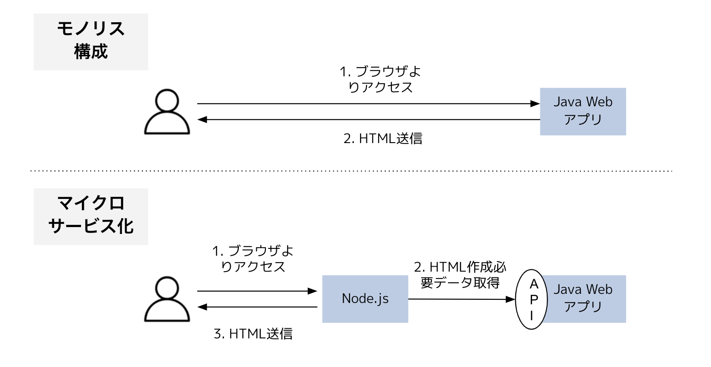  


### 3.1 モノリスアプリのデプロイ
最初に、本演習で使用するモノリスアプリ想定のJava Webアプリケーションをデプロイします。
> 使用するプロジェクト(ms-$(oc whoami))は、Service Mesh適用設定のために、既に講師の方で作成済みです。プロジェクトが無い場合は、講師までご一報下さい。
> 必要資材は、前章と同様に、`https://gitlab.com/openshift-starter-kit/msa-practice.git`内にあります。

```
cd $HOME
oc project ms-$(oc whoami)
oc new-build --name=java-backend --strategy=source --binary=true -i java:11 -n ms-$(oc whoami)
oc start-build java-backend --from-file=./msa-practice/resources/java-backend-1.0.1-SNAPSHOT.jar -n ms-$(oc whoami) --follow
oc new-app java-backend -n ms-$(oc whoami)
oc expose svc java-backend -n ms-$(oc whoami)
```

java-backend podの起動後、`oc get route`で取得したHOST/PORT値を使用して、ブラウザより`/hello`パスにアクセスし、以下の様な、java-backend pod上での日時を含む画面が表示されることを確認します。
> `http`プロトコルですので、ご注意下さい。

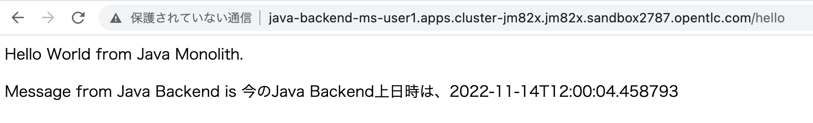  

以上で、本節は、終了です。

### 3.2 モノリスアプリの分割

最初に、演習を有意義な体験とするために、前節でデプロイしたモノリスアプリに関して、以下背景情報を想定することにしますので、ご確認下さい。
- モノリスアプリでは、HTMLコードをJavaコード上で作成しており、画面側での変更要件への対応に、ものすごい時間がかかる状態。
- Webアプリ利用者からは、画面が使いづらいとクレームが出ている。
- モノリスアプリのデプロイの度に、性能劣化やネットワーク疎通確認出来ない等の問題が頻繁に発生しており、品質に問題あり。

上記モノリスアプリの問題を考慮し、このモノリスアプリを分割することで、マイクロサービス化していきます。

#### 3.2.1 Node.js Podのデプロイ
最初に、画面利用者側からの変更要件への対応が、柔軟に出来るよう、モノリスアプリのHTML生成処理をNode.jsで動くHTTPサーバーPodに移管します。その為に、Node.jsで動くHTTPサーバーPodを以下コマンドによりデプロイします。

```
oc project ms-$(oc whoami)
oc new-build --name=nodejs-frontend --strategy=source --binary=true -i nodejs:latest -n ms-$(oc whoami)
oc start-build nodejs-frontend --from-dir=./msa-practice/resources/nodejs -n ms-$(oc whoami) --follow
oc new-app nodejs-frontend -n ms-$(oc whoami)
oc expose svc nodejs-frontend -n ms-$(oc whoami)
```
nodejs-frontend podの起動後、`oc get route`で取得したHOST/PORT値を使用して、ブラウザより`/`パスにアクセスし、以下の様なNode.jsが生成したHTML画面が表示されることを確認します。この画面と前節のモノリスアプリの出力画面とを比較し、構成に大きな違いはないこと、及び、CSSによりスタイルが変更されていることを確認し、モノリスアプリからHTML画面生成処理を切り出すことにより、画面利用者側からの変更要件対応が容易になることをイメージして下さい。

> `http`プロトコルですので、ご注意下さい。

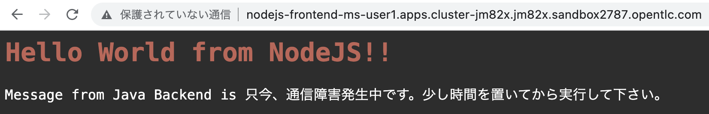  

一方で、HTML画面上にて、`通信障害発生中`のメッセージが出力されてることを確認し、前節のモノリスアプリで出力されたjava-backend podの時刻と異なることを確認します。また、その理由を推測して下さい。

#### 3.2.2 Node.js Podとモノリスアプリ公開APIの連携設定
前節のHTML画面上にて、`通信障害発生中`のメッセージが出力される理由は、以下図の2番目の処理である、モノリスアプリ(=図中のJava Webアプリ)へのAPI呼び出し連携設定が、未設定であるためです。

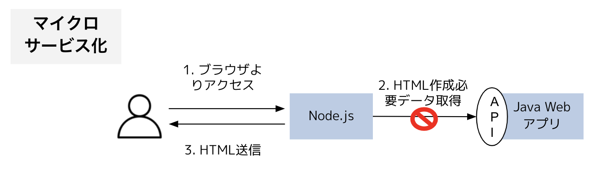  

そこで、Node.js Podとモノリスアプリ公開APIの接続設定を以下コマンドにより行います。

```
oc set env deployment/nodejs-frontend BACKEND_URL=http://java-backend BACKEND_PORT=8080 -n ms-$(oc whoami)
```

提供Node.jsのプログラムでは、環境変数`BACKEND_URL`と`BACKEND_PORT`にモノリスアプリ公開APIのURLとPORT番号を設定出来る作りになっています(具体的には、以下コード参照)。このため、`BACKEND_URL`には、java-backend Serviceの値、`BACKEND_PORT`には、8080を設定しています。

```
const BACKEND_URL=process.env.BACKEND_URL || 'http://localhost'
const BACKEND_PORT=process.env.BACKEND_PORT || '18080'
...
app.get("/", (req0, res0) => {
    req0.setTimeout(30000);
    http.get(BACKEND_URL + ':' + BACKEND_PORT + '/api', res => {
```

> 本演習では、環境変数による接続設定を行いましたが、環境変数設定は、設定数が多くなると管理が煩雑になる傾向がありますので、代わりにConfigMapの使用を検討することも有用ですので、ご参考までに。

環境変数の適用がPodにされた後、再度、Node.js Podにブラウザよりアクセスし、以下の様に、java-backend podの時刻が出力されることを確認します。また、以上より、マイクロサービス化により、マイクロサービス間での通信処理の必要性を確認して下さい。

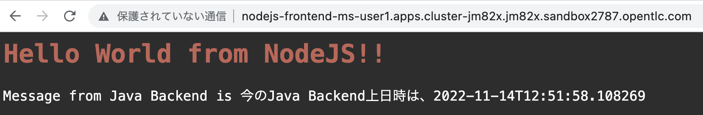  


### 3.3 マイクロサービスのスケーラビリティ体験
	
本節では、モノリスアプリのリリース作業後に性能問題が発生したことを想定し、モノリスアプリのスケールアウトにより問題を解消する演習を行います。

最初に、現段階の環境にて、以下コマンドによりNode.js podに対して2つのリクエストを並列に投入し、2つのHTMLレスポンスがすぐに返ってくるこを確認します。

```
seq 1 2 | xargs -I % -P2 curl $(oc get route nodejs-frontend -o jsonpath='{.spec.host}' -n ms-$(oc whoami))
```

実行結果例

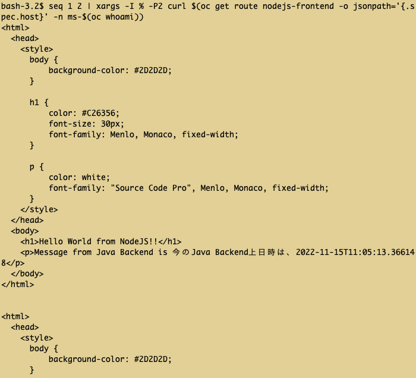  

次に、モノリスアプリのリリース作業後に性能問題が発生したことを想定するために、以下コマンドにより、モノリスアプリのAPI処理が、1処理につき5秒、且つ、1スレッドでの逐次処理になる動作に変更します。

```
oc set env deployment/java-backend VERSION=slow -n ms-$(oc whoami)
```

この時点で、先程の以下コマンドを実行し、2つのHTMLレスポンスの取得に10秒程の時間がかかることを確認します。

```
seq 1 2 | xargs -I % -P2 curl $(oc get route nodejs-frontend -o jsonpath='{.spec.host}' -n ms-$(oc whoami))
```

この性能問題を解消として、2つのHTMLレスポンスの取得に約5秒になることを目的として、以下コマンドによりモノリスアプリのPod数を2つに変更します。

```
oc scale deployment/java-backend --replicas=2 -n ms-$(oc whoami)
```

次に、Routerからの同一java-backend podへのリクエスト送信を回避するために、以下コマンドによりCookieの無効化とRoundRobinによるルーティング設定を行います。

```
oc annotate routes nodejs-frontend haproxy.router.openshift.io/disable_cookies='true' -n ms-$(oc whoami)
oc annotate routes nodejs-frontend haproxy.router.openshift.io/balance='roundrobin' -n ms-$(oc whoami)
```


`oc get pod`コマンドにより、java-backend podが2つになったことを確認し、再度、以下コマンドによりリクエストを送信します。

```
seq 1 2 | xargs -I % -P2 curl $(oc get route nodejs-frontend -o jsonpath='{.spec.host}' -n ms-$(oc whoami))
```

結果として、2つのHTMLレスポンスの取得に約5秒になることを確認し、スケールアウトの有用性を確認します。

> 本演習のモノリスアプリ、及び分割してNode.js podに切り出した処理は、処理の規模が小さいので、スケールアウトの有用性を感じることに抵抗があるかもしれませんが、その場合は、対象モノリスアプリが物凄く巨大であり、スケールアウトが容易でないモノリスアプリを想定してみて下さい。スケールアウトが必要なマイクロサービスのみをスケールアウト出来ることで、必要最低限のリソース消費に抑えることが可能となり、従来のモノリスアプリのスケールアウトの難しさを解消出来ることをご留意頂ければと思います。

### [任意演習] 3.4 Service Meshによるマイクロサービス間での通信エラー対応

> 本節は、任意の演習課題です。講義において扱わないService Meshを使用した演習となり、難易度が高い内容となっているためです。時間に余裕のある方や、Service Meshに興味のある方、チャレンジ好きの方のみ実施して下さい。

#### 3.4.1 通信エラー時の挙動確認
本節では、モノリスアプリにて障害が発生し、Node.js podからの通信が出来ない場合の動き、及び、その対応として、Service Meshによる対応方法を学習します。

最初に、障害を想定して、モノリスアプリであるjava-backend podのreplica数を以下コマンドによりゼロに設定します。

```
oc scale deployment/java-backend --replicas=0 -n ms-$(oc whoami)
```

nodejs-frontend podのrouteに以下の様なcurlコマンドにより、アクセスし、30秒ほど待ちます。

```
curl $(oc get route nodejs-frontend -o jsonpath='{.spec.host}' -n ms-$(oc whoami))
```

30秒後に、以下画面の様なレスポンスが取得出来ることを確認します。

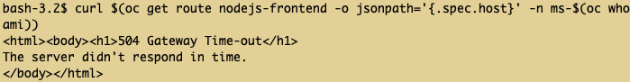  

> 上記コマンドを複数回連続して実行すると、Node.jsが、モノリスアプリに対するTimeoutではなく、Connection Refused発生と判断する場合があり、その場合は、HTMLレスポンスが表示されます。

現実的に、通信先であるモノリスアプリの障害時に、30秒も待つのは、画面利用者にとっては非効率であり、タイムアウト値をより短く設定することが望ましいと考えられます。そこで、次節では、Service Meshを使用したタイムアウト設定を行います。

#### 3.4.2 Service Meshによるタイムアウト設定

Service Meshによるタイムアウト設定は、大きく、以下図に示す3つの設定から行います。

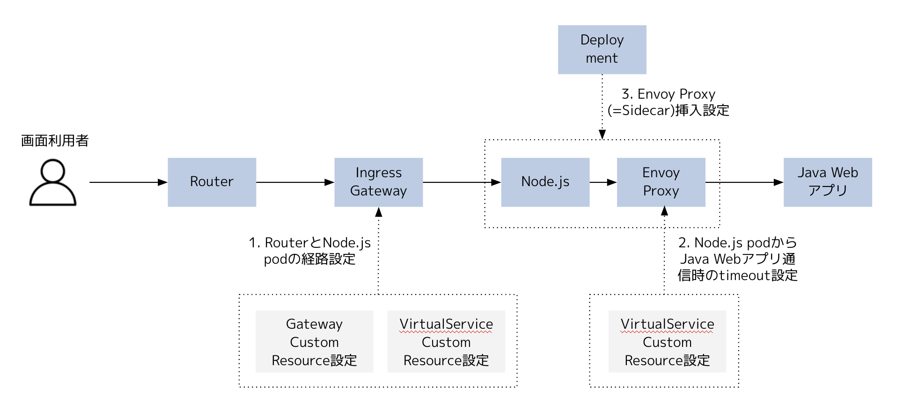  


##### 3.4.2.1 RouterとNode.js podの経路設定

最初に、IngressGatewayに対する設定により、RouterとNode.js podの経路設定を行います。IngressGatewayは、Service Meshの通信網に対する外部からの入り口に該当するEnvoy Proxyであり、OpenShift上のService Meshでは、IngressGateway設定により、自動的にRouteを作成する機能を提供しているため、結果として、OpenShift外部から、Router経由で、IngressGatewayへと通信経路が確立されます。

最初に、Gateway Custom Resource(以降CR)を以下の様なコマンドにより作成し、RouterとIngressGatewayの通信経路設定を行います。
> `metadata.name`は、自分のuser名に、また、`spec.hosts`は、使用環境のドメイン、及び、自分のuser名を使用して適宜変更して下さい。また、これ以降、同様の読み替えをお願い致します。

```
cat <<EOF | oc apply -n ms-$(oc whoami) -f -
apiVersion: networking.istio.io/v1alpha3
kind: Gateway
metadata:
  name: ms-user1-gw
spec:
  selector:
    istio: ingressgateway
  servers:
  - port:
      number: 80
      name: http
      protocol: HTTP
    hosts:
    - "ms-user1-gw.apps.cluster-jm82x.jm82x.sandbox2787.opentlc.com"
EOF
```

上記設定により、Routerへ`ms-user1-gw.apps.cluster-jm82x.jm82x.sandbox2787.opentlc.com`宛のリクエストが来た時、Routerは、IngressGatewayへリクエストを転送します。

次に、上記Gateway設定により、RouterからIngressGatewayへ到達したリクエストをどこに転送すべきかの設定をVirtualService設定により行います。以下コマンドを実行して下さい。

```
cat <<EOF | oc apply -n ms-$(oc whoami) -f -
apiVersion: networking.istio.io/v1alpha3
kind: VirtualService
metadata:
  name: user1-frontend-vs
spec:
  hosts:
  - "ms-user1-gw.apps.cluster-jm82x.jm82x.sandbox2787.opentlc.com"
  gateways:
    - ms-user1-gw
  http:
  - route:
    - destination:
        host: nodejs-frontend
        port:
          number: 8080
EOF
```

上記VirtualService設定により、RouterからIngressGatewayへ到達したリクエストは、nodejs-frontendへ転送されます。

動作確認として、`curl ms-user1-gw.apps.cluster-jm82x.jm82x.sandbox2787.opentlc.com`を実行し、3.4.1にて確認した挙動と同じになることを確認します。

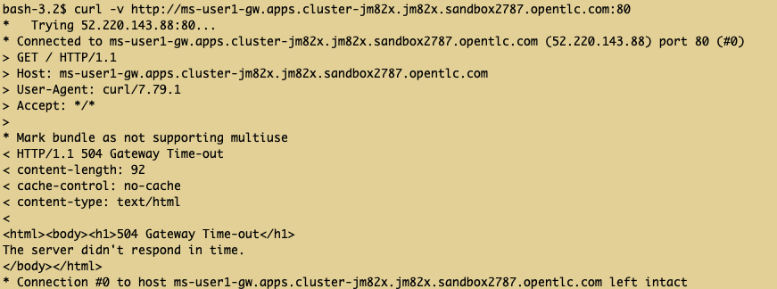  

以上で、RouterとNode.js podの経路設定は、完了です。

##### 3.4.2.2 Node.js podからJava Webアプリ通信時のtimeout設定

現在、長すぎるtimeout値となっているNode.js podからJava Webアプリ通信時のtimeout設定は、以下の様なVirtualService作成により行います。以下設定により、`spec.hosts`にて定義したService(=java-backend)に対するリクエストは、`spec.http.timeout`の設定値(1s)に設定されます。

```
cat <<EOF | oc apply -n ms-$(oc whoami) -f -
apiVersion: networking.istio.io/v1alpha3
kind: VirtualService
metadata:
  name: user1-backend-vs
spec:
  hosts:
  - java-backend
  http:
  - route:
    - destination:
        host: java-backend
    timeout: 1s
EOF
```

##### 3.4.2.3 Envoy Proxy(=Sidecar)挿入設定
3.4.2.2で設定したtimeout値を有効化するためには、Node.js Podのサイドカーとして、Envoy Proxyを挿入する必要があります。これにより、Envoy Proxyに対してVirtualServiceのTimeout値設定を反映されることになります。Envoy Proxyの挿入は、以下コマンドにより行います。

```
oc patch deployment/nodejs-frontend -p '{"spec":{"template":{"metadata":{"annotations":{"sidecar.istio.io/inject": "true"}}}}}' -n ms-$(oc whoami)
```

`oc get pod`の結果、nodejs-frontend podのREADYカラムが、`2/2`になっていることを確認します。`2/2`とは、分子が、起動しているコンテナ数、分母が、Podに定義されているコンテナ数となり、Envoy Proxyが挿入されることで、起動コンテナ数、定義コンテナ数が、ともに2になっていることが確認出来ます。

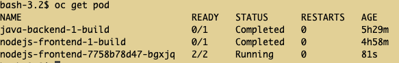  


#### 3.4.3 動作確認

動作確認として、`curl ms-user1-gw.apps.cluster-jm82x.jm82x.sandbox2787.opentlc.com`を実行します。1秒のTimeout待ち後、すぐにレスポンスが返ってくることを確認し、Service Meshのtimeout設定が効いていることを確認します。

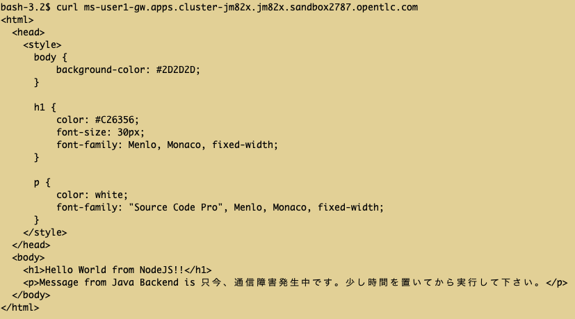  

以上で、本演習は、全て完了です。ありがとうございました。


