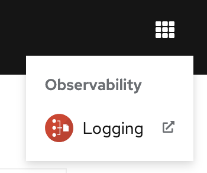
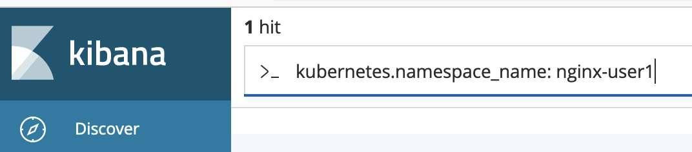
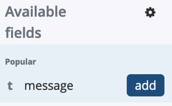
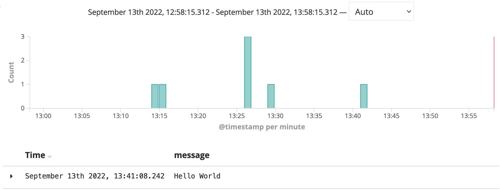
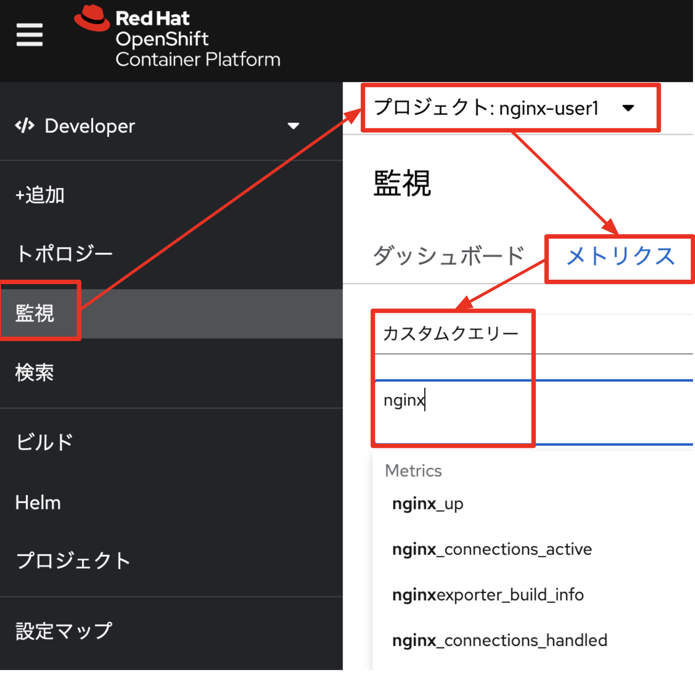
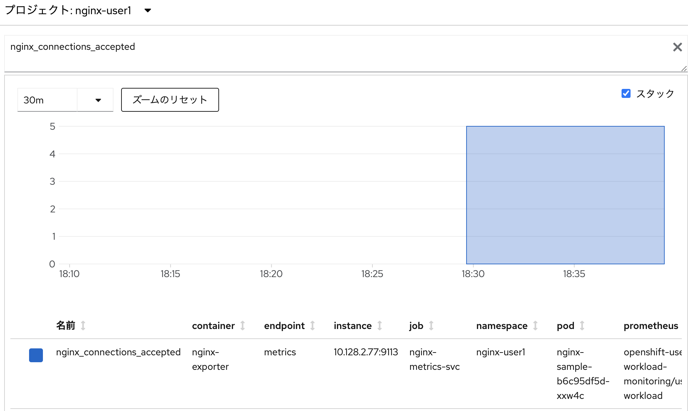
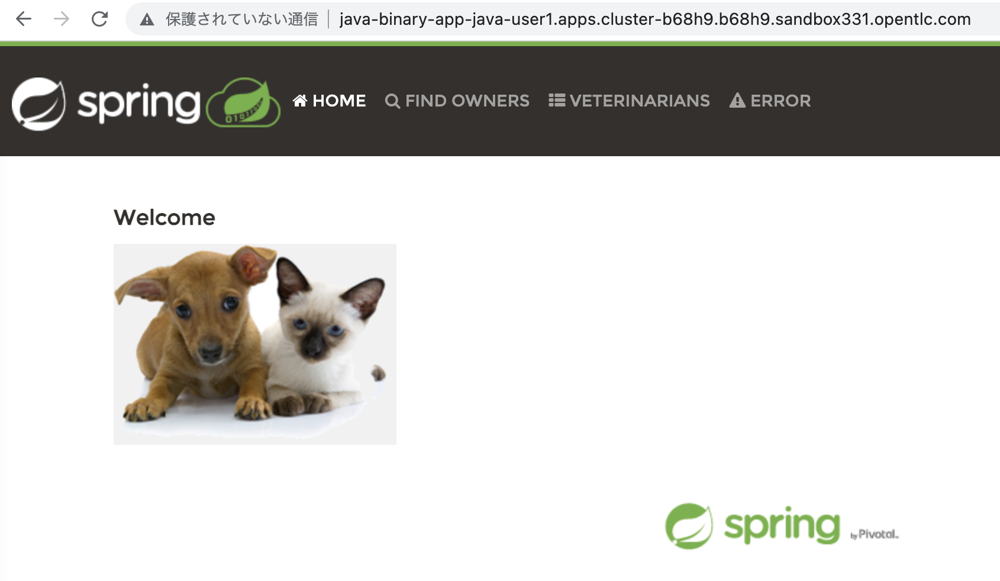
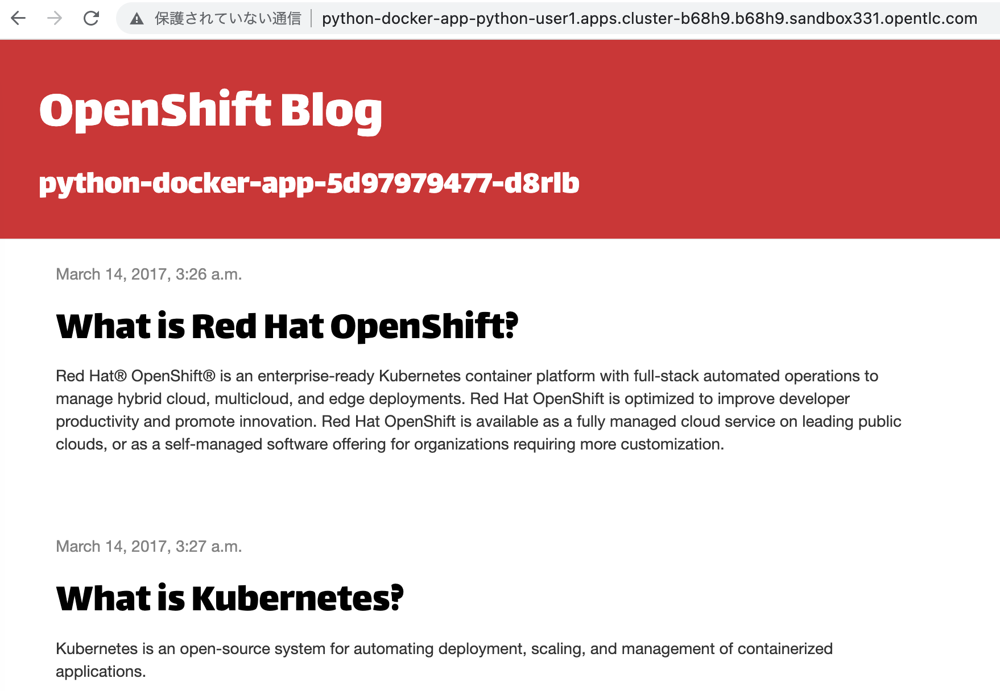

# Container Starter Kit 開発編
本ハンズオンでは、OpenShift上で動かすコンテナアプリを実装するために必要となる作業を体験して頂くことで、コンテナアプリ作成に必要な知識を学習し、理解を深めることを目的とします。

- [Container Starter Kit 開発編](#container-starter-kit-開発編)
  - [1. コンテナアプリ必要機能の実装](#1-コンテナアプリ必要機能の実装)
    - [1.1 CPU/Memoryリソース設定](#11-cpumemoryリソース設定)
    - [1.2 ログ出力](#12-ログ出力)
    - [1.3 外部ストレージとの連携](#13-外部ストレージとの連携)
    - [1.4 コンテナライフサイクル管理](#14-コンテナライフサイクル管理)
    - [1.5 Metrics監視](#15-metrics監視)
      - [1.5.1 NGINX Prometheus Exporterの設定](#151-nginx-prometheus-exporterの設定)
      - [1.5.2 Prometheus設定](#152-prometheus設定)
      - [1.5.3 動作確認](#153-動作確認)
  - [2. OpenShift上でのコンテナイメージビルド方法](#2-openshift上でのコンテナイメージビルド方法)
    - [2.1 Binaryソースを使用したS2Iビルド](#21-binaryソースを使用したs2iビルド)
    - [2.2 Binaryソースを使用したDockerビルド](#22-binaryソースを使用したdockerビルド)

## 1. コンテナアプリ必要機能の実装

本章は、Nginxを使用して、コンテナアプリに必要となる機能の実装体験することを目的とします。

最初に、Nginxを起動します。具体的には、本ドキュメント格納Gitリポジトリの`resources/nginx`配下に格納されているhtml等のソースコードとOpenShift提供のNginxベースイメージを使用して、新たにコンテナイメージを作成し、そのコンテナイメージをPodとして起動します。

最初に、Web Terminalを起動します。ブラウザよりOpenShift Web Consoleにアクセスし、ログイン後、画面右上の>_アイコンをクリックし、Web Terminalを起動します。

> 補足: 初回起動時は、少々時間がかかりますので、お待ち下さい。

  


次に、Web Terminal上から、OpenShift上にプロジェクト(名前: nginx-<ユーザー名>)を作成し、Nginx起動のために必要な操作を行います。

```
oc new-project nginx-$(oc whoami)
oc new-build --name=nginx-sample nginx:latest~"https://gitlab.com/openshift-starter-kit/msa-practice.git" --context-dir=resources/nginx -n nginx-$(oc whoami)
oc new-app nginx-sample -n nginx-$(oc whoami)
oc expose svc nginx-sample -n nginx-$(oc whoami)
```

以下、上記コマンドの説明です。
- oc new-build
  - BuildConfigの作成用コマンド
  - `nginx:latest`
    - OpenShiftで提供するNginxベースイメージをポイントするImageStreamとそのタグ(=latest)
  - `https://gitlab.com/openshift-starter-kit/msa-practice.git`
    - ソースコード格納リポジトリ
  - `--context-dir`
    - ソースコード格納リポジトリ内にて、イメージ作成に使用するディレクトリ指定
- oc new-app
  - ImageStreamを指定して、Deployment/Service/Podを作成し、Pod起動するコマンド  

Nginxが起動したことを確認後、以下コマンドによりNginxにアクセスし、入力ソースコードとして指定したhtmlファイルの内容が取得出来ることを確認します。

```
oc exec $(oc get pod -l deployment=nginx-sample -o NAME -n nginx-$(oc whoami))  -n nginx-$(oc whoami) -- curl http://localhost:8080
```

以下、上記コマンドの説明です。
- oc exec
  - 指定するPod内部にて、`--`以降に指定するコマンドを実行するためのコマンド

出力例
```
<html>
<head>
        <title>Test NGINX passed</title>
</head>
<body>
<h1>NGINX is working</h1>
</body>
</html>
```

### 1.1 CPU/Memoryリソース設定

本節では、コンテナに対するCPU/Memoryリソース設定方法を体験する目的で、Nginxで使用するメモリ量を敢えて少ない値(=1MB)に設定し、どのような結果になるか確認します。

最初に、以下コマンドにより、NginxのDeployment(=nginx-sample)に対して、メモリlimitを設定します。

```
oc set resources deployment nginx-sample --limits=cpu=1,memory=1Mi -n nginx-$(oc whoami)
```

出力例
```
deployment.apps/nginx-sample resource requirements updated
```

`oc get pod -n nginx-$(oc whoami)`を実行し、PodのStatusが、`ContainerCreating`になっていることを確認します。

出力例
```
bash-3.2$ oc get pod -n nginx-$(oc whoami)
NAME                            READY   STATUS              RESTARTS   AGE
nginx-sample-1-build            0/1     Completed           0          46m
nginx-sample-666c5f7c59-qpsqb   0/1     ContainerCreating   0          2m48s
nginx-sample-85987c9959-kp52g   1/1     Running             0          45m
```

`ContainerCreating`になっているPodに対して、以下の用な`oc describe`を実行し、最下部にある`Events`の内容を確認します。
> 指定するPod名は、ご自身の使用環境に応じて、適宜変更して下さい。

```
oc describe pod nginx-sample-666c5f7c59-qpsqb  -n nginx-$(oc whoami)
```

出力例
```
Events:
  Type     Reason                  Age                   From               Message
  ----     ------                  ----                  ----               -------
  Normal   Scheduled               12m                   default-scheduler  Successfully assigned nginx-user1/nginx-sample-666c5f7c59-qpsqb to ip-10-0-189-243.ap-southeast-1.compute.internal
  Warning  FailedCreatePodSandBox  2m51s (x48 over 12m)  kubelet            Failed to create pod sandbox: rpc error: code = Unknown desc = pod set memory limit 1048576 too low; should be at least 12582912
 ```

上記Eventsの出力である`pod set memory limit 1048576 too low`より、割り当てメモリ量が少ないため、Nginx起動が出来ないことが分かります。この問題を解消するために、以下コマンドにより、Nginxで使用するメモリ量を32MBに指定します。

```
oc set resources deployment nginx-sample --limits=cpu=1,memory=32Mi -n nginx-$(oc whoami)
```

`oc get pod -n nginx-$(oc whoami)`を実行し、PodのStatusが、`Running`になることを確認します。

出力例
```
NAME                            READY   STATUS      RESTARTS   AGE
nginx-sample-1-build            0/1     Completed   0          61m
nginx-sample-56c7576cbb-g7jdb   1/1     Running     0          35s
```

以上で、本章は終了となります。

### 1.2 ログ出力
本章では、Pod内で標準出力に書き出したログが、oc logsやopenshift-loggingに連携されることを体験する目的で、Nginx Pod内部のShellより、任意のログメッセージを標準出力に書き込み、そのログメッセージが、oc logsや、openshift-loggingで取得出来ることを確認します。

最初に、`oc rsh`コマンドにより、指定したPod名(以下例: nginx-sample-56c7576cbb-g7jdb)に対してRemote Shell接続します。

コマンド例(Pod名は、適宜変更して下さい)
```
oc rsh -n nginx-$(oc whoami) nginx-sample-56c7576cbb-g7jdb
```

次に、以下コマンドにより、標準出力に任意のログメッセージ(以下例: Hello World)を書き込みます。

```
echo Hello World >> /proc/1/fd/1
```

次に、`oc logs`コマンドにより、ログメッセージが取得出来ることを確認します。

```
oc logs <Nginx Pod名>
```

出力例
```
10.128.2.6 - - [13/Sep/2022:03:22:00 +0000] "GET / HTTP/1.1" 200 105 "-" "curl/7.61.1"
10.128.2.6 - - [13/Sep/2022:04:14:03 +0000] "GET / HTTP/1.1" 200 105 "-" "curl/7.79.1"
10.128.2.6 - - [13/Sep/2022:04:15:50 +0000] "GET / HTTP/1.1" 200 105 "-" "curl/7.79.1"
2022/09/13 04:26:25 [error] 19#0: *4 open() "/opt/app-root/src/hoge" failed (2: No such file or directory), client: 10.129.2.4, server: _, request: "GET /hoge HTTP/1.1", host: "nginx-sample-nginx-user1.apps.cluster-b68h9.b68h9.sandbox331.opentlc.com"
2022/09/13 04:26:25 [error] 19#0: *4 open() "/opt/app-root/src/404.html" failed (2: No such file or directory), client: 10.129.2.4, server: _, request: "GET /hoge HTTP/1.1", host: "nginx-sample-nginx-user1.apps.cluster-b68h9.b68h9.sandbox331.opentlc.com"
10.129.2.4 - - [13/Sep/2022:04:26:25 +0000] "GET /hoge HTTP/1.1" 404 153 "-" "curl/7.79.1"
hello
Hello World
```

> 以下演習は、openshift-loggingを使用し、マシンリソースの消費が大きくなりますので、演習環境によっては、実施不可能の場合がありますので、ご留意下さい。

次に、openshift-loggingで提供される[Kibana](https://docs.openshift.com/container-platform/4.10/logging/cluster-logging-visualizer.html)にアクセスし、ログメッセージを確認します。

OpenShift Web Consoleより、画面右上の格子状アイコン -> Loggingをクリックします。

  

Kibanaログイン画面にてOpenShiftログインに使用するユーザー名とパスワードを使用してログインし、画面左メニューの`Discover`をクリックし、画面上部に表示される検索バーに、`kubernetes.namespace_name: nginx-<自分のユーザー名>`と入力します。これにより、Nginx Podが存在するプロジェクトに関するログ情報を取得します。

  


`Available fields`より、`message`を`add`ボタンにより追加します。これにより、ログメッセージが、表示されるようになります。

  

標準出力に書き込みしたログメッセージが、出力されることを確認します。
> 出力されない場合は、画面右上のRefreshボタンや、Refreshボタンの上にあるTime Rangeを変更してみて下さい。

  

以上で、本章は終了です。

### 1.3 外部ストレージとの連携
本章では、外部ストレージとの連携体験を目的として、Nginx PodにPersistent Volumeをマウントし、そのPersistent Volumeにhtmlファイルを保存し、Router経由でアクセス出来ることを確認します。

最初に、以下コマンドにより、Nginx PodにPersistentVolumeをマウントします。
```
oc set volume deploy/nginx-sample --claim-size=4Mi --add --name=html-volume-1 --mount-path=/opt/app-root/src/pv -n nginx-$(oc whoami)
```

以下、上記コマンドの説明です。
- oc set volume
  - PersistentVolumeをDeploymentに対して設定するコマンド
  - `--claim-size`
    - 使用したいPersistetVolumeのサイズ
  - `--add`
    - PersistentVolume追加操作
  - `--name`
    - Deploymentで使用する任意のVolume名
  - `--mount-path`
    - PersistentVolumeのコンテナ内マウントパス

次に、以下コマンドにより、テスト用htmlファイルを作成します。

```
cat <<EOF > $HOME/pv.html
<html>
<head>
  <title>PV Test</title>
</head>
<body>
  <h1>Hello World from PV</h1>
</body>
</html>
EOF
```

次に、以下コマンドのPod名を変更した上で、Nginx PodでマウントしたPersistentVolume配下へコピーします。

```
oc cp $HOME/pv.html <Pod名>:/opt/app-root/src/pv -n nginx-$(oc whoami)
```

以下コマンドにより、PersistentVolumeにコピーしたhtmlファイルにRouter経由でアクセスし、コピーしたhtmlファイル内容が取得されることを確認します。

```
curl $(oc get route nginx-sample -o jsonpath='{.spec.host}' -n nginx-$(oc whoami))/pv/pv.html
```

出力例
```
bash-4.4 ~ $ curl $(oc get route nginx-sample -o jsonpath='{.spec.host}' -n nginx-$(oc whoami))/pv/pv.html
<html>
<head>
  <title>PV Test</title>
</head>
<body>
  <h1>Hello World from PV</h1>
</body>
</html>
```

以上で、本章は終了です。

### 1.4 コンテナライフサイクル管理

本章では、コンテナライフサイクル管理の体験を目的として、PreStop Hookの設定にて、Graceful Shutdownを想定したSleep処理を挿入し、その動作確認を行います。

最初に、以下コマンドにより、Nginx用のDeploymentリソースを編集モードで開きます。

```
oc edit deploy nginx-sample -n nginx-$(oc whoami)
```

次に、`spec.template.spec.containers`配下のNginxコンテナ定義箇所に以下内容を追記します。

> 注意: 手動編集ですので、空白行のズレ等にご注意下さい。

```
        lifecycle:
          preStop:
            exec:
              command:
              - /bin/sh
              - -c
              - echo "let's sleep at $(date)!!" >> /opt/app-root/src/pv/sleep.log; sleep 5
```              

編集結果例(一部抜粋)
```
      - image: image-registry.openshift-image-registry.svc:5000/nginx-user1/nginx-sample@sha256:47942734057f45a49d5b072a76edc10e882570f0765f5dc5b5a7be4ee9838e11
        imagePullPolicy: IfNotPresent
        lifecycle:
          preStop:
            exec:
              command:
              - /bin/sh
              - -c
              - echo "let's sleep at $(date)!!" >> /opt/app-root/src/pv/sleep.log;
                sleep 5
        name: nginx-sample
        ports:
        - containerPort: 8443
          protocol: TCP
        - containerPort: 8080
          protocol: TCP
```          

Deployment編集後、Nginxが自動的に再起動されます。再起動された後、Nginx Podを以下コマンドにより削除します。

```
oc delete pod <Nginx Pod名> -n nginx-$(oc whoami)
```

再度、Nginx Podが起動するので、oc rshコマンドにより、Remote Shell接続し、PreStopで定義したメッセージが、sleep.logに出力されていることを確認します。

```
oc exec <Pod名> -c nginx-sample -n nginx-$(oc whoami) -- cat /opt/app-root/src/pv/sleep.log
```

出力例
```
let's sleep at Tue Sep 13 10:32:59 UTC 2022!!
```

以上で、本章は終了です。
次の演習のために、マウントしたPersistentVolumeを以下コマンドでアンマウントして下さい。
```
oc set volume deploy/nginx-sample --name=html-volume-1 --remove -n nginx-$(oc whoami)
```

### 1.5 Metrics監視
> 本章は、OpenShift初学者にとっては、難易度が少々高いので、時間に余裕のある方向けの内容となっております。

本章では、Metrics監視設定方法を体験する目的で、Nginx Podに[NGINX Prometheus Exporter](https://github.com/nginxinc/nginx-prometheus-exporter)をコンテナとして組み込むことでMetrics公開を行い、openshift-monitoringからMetrics表示確認を行います。

#### 1.5.1 NGINX Prometheus Exporterの設定

最初に、Nginx Deploymentに、NGINX Prometheus Exporterをコンテナとして起動する設定を行います。

最初に、以下コマンドにより、Nginx用Deploymentを編集モードで開きます。

```
oc edit deploy nginx-sample -n nginx-$(oc whoami)
```

次に、`spec.template.spec.containers`配下に以下内容を追記します。

> 注意: 手動編集ですので、空白行のズレ等にご注意下さい。

```yaml
      - name: nginx-exporter
        image: 'nginx/nginx-prometheus-exporter:0.10.0'
        args:
          - '-nginx.scrape-uri=http://localhost:8080/stub_status'
        resources:
          limits:
            memory: 128Mi
            cpu: 500m
        ports:
          - containerPort: 9113
```

編集結果例(一部抜粋)
```
  template:
    metadata:
      annotations:
        openshift.io/generated-by: OpenShiftNewApp
      creationTimestamp: null
      labels:
        deployment: nginx-sample
    spec:
      containers:
      - name: nginx-exporter
        image: 'nginx/nginx-prometheus-exporter:0.10.0'
        args:
          - '-nginx.scrape-uri=http://localhost:8080/stub_status'
        resources:
          limits:
            memory: 128Mi
            cpu: 500m
        ports:
          - containerPort: 9113      
      - image: image-registry.openshift-image-registry.svc:5000/nginx-user1/nginx-sample@sha256:47942734057f45a49d5b072a76edc10e882570f0765f5dc5b5a7be4ee9838e11
        imagePullPolicy: IfNotPresent
        name: nginx-sample

```

`oc get pod -n nginx-$(oc whoami)`を実行し、Nginx Podの`READY`カラムが、`2/2`になることを確認します。`2/2`とは、Nginx Podの中に2つのコンテナが定義されていて(分母)、起動してREADY状態になっているコンテナが2つ存在すること(分子)を意味します。

出力例
```
NAME                           READY   STATUS      RESTARTS        AGE
nginx-sample-1-build           0/1     Completed   0               18m
nginx-sample-b6c95df5d-xxw4c   2/2     Running     1 (2m38s ago)   2m40
```

また、動作確認として、以下コマンドにより、Metricsが取得出来ることを確認します。`nginx-sample-b6c95df5d-xxw4c`は、上述のoc get podで出力されるPod名に適宜置き換えて下さい。

```
oc exec nginx-sample-b6c95df5d-xxw4c -c nginx-sample -n nginx-$(oc whoami) -- curl http://localhost:9113/metrics
```

出力例
```
# HELP nginx_connections_accepted Accepted client connections
# TYPE nginx_connections_accepted counter
nginx_connections_accepted 3
# HELP nginx_connections_active Active client connections
# TYPE nginx_connections_active gauge
nginx_connections_active 1
# HELP nginx_connections_handled Handled client connections
# TYPE nginx_connections_handled counter
nginx_connections_handled 3
# HELP nginx_connections_reading Connections where NGINX is reading the request header
# TYPE nginx_connections_reading gauge
nginx_connections_reading 0
# HELP nginx_connections_waiting Idle client connections
# TYPE nginx_connections_waiting gauge
nginx_connections_waiting 0
# HELP nginx_connections_writing Connections where NGINX is writing the response back to the client
# TYPE nginx_connections_writing gauge
nginx_connections_writing 1
# HELP nginx_http_requests_total Total http requests
# TYPE nginx_http_requests_total counter
nginx_http_requests_total 5
# HELP nginx_up Status of the last metric scrape
# TYPE nginx_up gauge
nginx_up 1
# HELP nginxexporter_build_info Exporter build information
# TYPE nginxexporter_build_info gauge
nginxexporter_build_info{commit="7a03d0314425793cf4001f0d9b0b2cfd19563433",date="2021-12-21T19:24:34Z",version="0.10.0"} 1
```

#### 1.5.2 Prometheus設定
次に、OpenShiftで提供する監視機能より、前節で公開設定したMetricsを取得するための設定を行います。

最初に、前節で公開したMetricsにアクセスするためのServiceを以下コマンドにより作成します。

```
cat <<EOF | oc create -f - -n nginx-$(oc whoami)
apiVersion: v1
kind: Service
metadata:
  name: nginx-metrics-svc
  labels:
    app: nginx-metrics
spec:
  type: ClusterIP
  ports:
    - name: "metrics"
      protocol: "TCP"
      port: 9113
      targetPort: 9113
  selector:
    deployment: nginx-sample
EOF
```

次に、以下コマンドにより、`ServiceMonitor`を作成します。`ServiceMonitor`は、openshift-monitoringで提供されるCustom Resourceであり、OpenShift内部では、prometheus operatorが、この`ServiceMonitor`の検出を行い、適宜Prometheusの設定変更を行います。

```
cat <<EOF | oc create -f - -n nginx-$(oc whoami)
apiVersion: monitoring.coreos.com/v1
kind: ServiceMonitor
metadata:
  name: nginx-monitor
spec:
  endpoints:
    - interval: 10s
      port: metrics
  selector:
    matchLabels:
      app: nginx-metrics
EOF
```

#### 1.5.3 動作確認
動作確認として、OpenShift Web Consoleより、公開したMetricsが取得出来るかの確認を行います。

OpenShift Web ConsoleをDeveloperビューで開き、左側メニューの監視をクリック => プロジェクト選択 => メトリクスクリック => クエリーの選択 => カスタムクエリーをクリック => `nginx`と入力します。

  

任意のMetrics(例: nginx_connections_accepted)を選択し、エンターボタンを押し、Metrics取得結果がグラフ表示されることを確認します。

  

以上で、本章は終了となります。

## 2. OpenShift上でのコンテナイメージビルド方法
本章では、開発時に一時的な検証のためにイメージ作成する時に有用な、Binaryソースを使用したビルド方式の体験を目的として、演習を行います。

### 2.1 Binaryソースを使用したS2Iビルド
最初に、以下コマンドにより、新規プロジェクトを作成し、BuildConfigを作成します。

```
oc new-project java-$(oc whoami)
oc new-build --name=java-binary-app --strategy=source --binary=true -i java:11 -n java-$(oc whoami)
```

以下、上記コマンドの説明です。
- oc new-build
  - BuildConfig作成用コマンド
  - `--strategy=source`
    - S2Iビルドを行うことを指定
  - `--binary=true`
    - Binaryソースを使用することを指定
  - `-i java:11` 
    - 使用するImageStream(=java:11)を指定

次に、使用するBinaryソースを用意します。本演習では、時間節約のために、ビルド済みjarファイルを使用します。以下コマンドにより、本演習資料のGitリポジトリをcloneします。

```
git clone https://gitlab.com/openshift-starter-kit/msa-practice.git
```

次に、作成したBuildConfigを元に、イメージ作成を実行します。
```
oc start-build java-binary-app --from-file=./msa-practice/resources/spring-petclinic-2.7.3.jar -n java-$(oc whoami)
```

動作確認として、作成したイメージよりPodを起動し、Route作成します。

```
oc new-app java-binary-app -n java-$(oc whoami)
oc expose svc java-binary-app -n java-$(oc whoami)
```

作成したRouteの`spec.host`に設定されたURLにブラウザよりアクセスし、以下の用なアプリ画面が表示されることを確認します。

  


### 2.2 Binaryソースを使用したDockerビルド

最初に、以下コマンドにより、新規プロジェクトを作成し、BuildConfigを作成します。

```
oc new-project python-$(oc whoami)
oc new-build --name=python-docker-app --strategy=docker --binary=true -n python-$(oc whoami)
```

以下、上記コマンドの説明です。
- oc new-build
  - BuildConfig作成用コマンド
  - `--strategy=docker`
    - Dockerビルドを行うことを指定
  - `--binary=true`
    - Binaryソースを使用することを指定

次に、使用するDockerfileと必要ソースを用意します。本演習では、[Python Blogアプリ]( https://github.com/openshift-katacoda/blog-django-py.git)を使用します。

```
git clone  https://github.com/openshift-katacoda/blog-django-py.git
```

次に、Python BlogアプリのDockerfileで指定されているベースイメージが古いイメージのため、以下コマンドにより、Dockerfileの編集を行います。

```
cd blog-django-py
sed -i '1s:.*:FROM registry.redhat.io/ubi8/python-39:' Dockerfile
```

次に、作成したBuildConfigを元に、イメージ作成を実行します。
```
oc start-build python-docker-app --from-dir=./ -n python-$(oc whoami)
```

以下、上記コマンドのオプション説明です。
- `--from-dir`
  - Dockerfileとその他関連ソースの存在するディレクトリを指定

動作確認として、作成したイメージよりPodを起動し、Route作成します。

```
oc new-app python-docker-app -n python-$(oc whoami)
oc expose svc python-docker-app -n python-$(oc whoami)
```

作成したRouteの`spec.host`に設定されたURLにブラウザよりアクセスし、以下の用なアプリ画面が表示されることを確認します。

  


以上で、本演習は、完了です。


